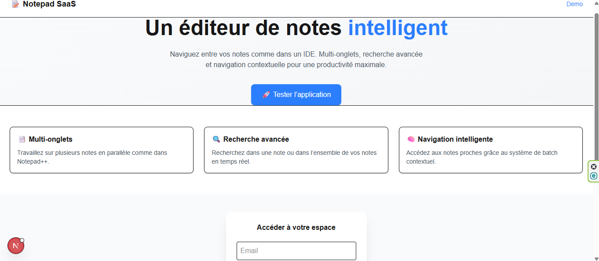
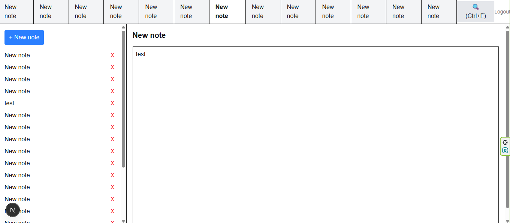
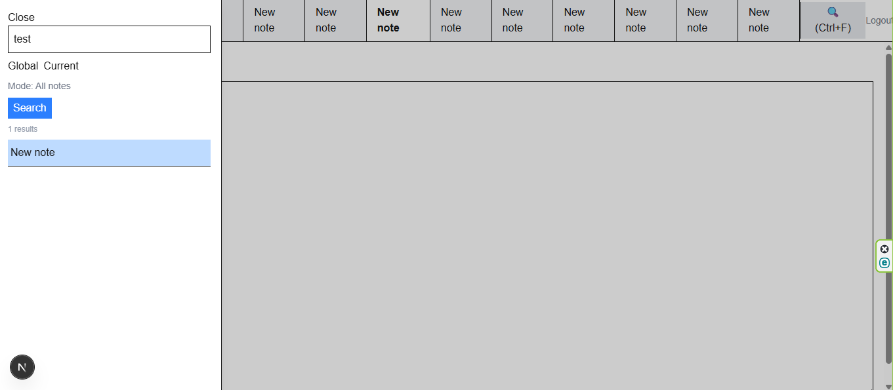

# 🧠 IDE-inspired Notes App

Application web moderne permettant de gérer des notes avec un système multi-onglets et une navigation intelligente inspirée des IDE (VS Code, Notepad++).

---

## 🚀 Démo

👉 https://notepadsaas.vercel.app/

---

## 📸 Captures d’écran

### Landing page


### Interface avec onglets


### Recherche avancée


---

## ✨ Fonctionnalités

### 📝 Gestion des notes
- Création, modification et suppression
- Données persistées avec Supabase

### 📑 Multi-onglets
- Jusqu’à 15 onglets ouverts
- Onglet actif toujours visible
- Rechargement automatique après refresh

### 🔍 Recherche avancée
- Recherche globale dans toutes les notes
- Recherche dans la note active
- Résultats en temps réel (live search)

### 🎯 Navigation contextuelle (feature clé)
- Clic sur un résultat → ouverture d’un groupe de notes
- Affichage des notes proches dans le temps
- Navigation fluide avec contexte conservé

### ⌨️ Navigation clavier
- Ctrl + F → ouvrir la recherche
- ↑ ↓ → naviguer dans les résultats
- Enter → ouvrir une note

### 🎨 Expérience utilisateur
- Interface inspirée des IDE
- Animations et micro-interactions
- Feedback visuel (hover, sélection, loading)

---

## 💡 Ce qui rend ce projet unique

Ce projet ne se limite pas à un simple CRUD.

Il implémente un système de **navigation contextuelle** :

> Lorsqu’un résultat de recherche est sélectionné, l’application charge un groupe de notes autour afin de conserver le contexte, similaire à la navigation dans un éditeur de code ou des logs.

👉 Cette approche améliore la lisibilité et la productivité utilisateur.

---

## 🧠 Stack technique

- **Frontend** : Next.js (App Router)
- **Backend / DB** : Supabase
- **Auth** : Supabase Auth
- **UI** : Tailwind CSS
- **State Management** : React Hooks (useState, useEffect)

---

## ⚙️ Installation

```bash
git clone https://github.com/o0nekov0o/notepad_saas.git
cd ton-repo
npm install
npm run dev