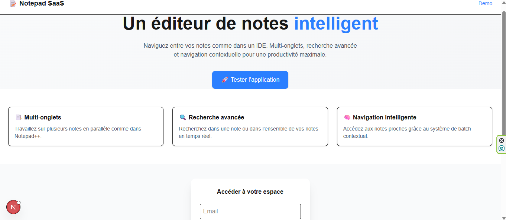
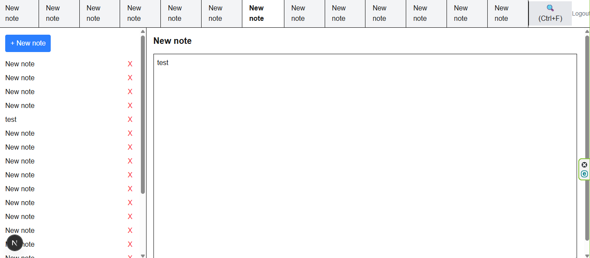
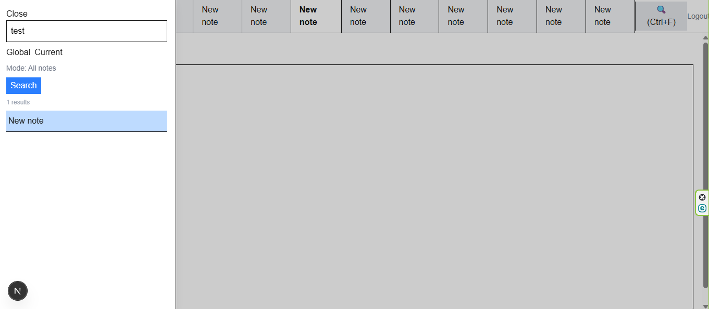

# 🧠 IDE-inspired Notes App

Application web moderne permettant de gérer des notes avec un système multi-onglets et une navigation intelligente inspirée des IDE (VS Code, Notepad++).

---

## 🚀 Démo

👉 https://notepadsaas.vercel.app/

---

## 📸 Captures d’écran

### Landing page


### Interface avec onglets


### Recherche avancée


---

## ✨ Fonctionnalités

### 📝 Gestion des notes
- Création, modification et suppression
- Données persistées avec Neon PostgreSQL

### 📑 Multi-onglets
- Jusqu’à 15 onglets ouverts
- Onglet actif toujours visible
- Rechargement automatique après refresh

### 🔍 Recherche avancée
- Recherche globale dans toutes les notes
- Recherche dans la note active
- Résultats en temps réel (live search)

### 🎯 Navigation contextuelle (feature clé)
- Clic sur un résultat → ouverture d’un groupe de notes
- Affichage des notes proches dans le temps
- Navigation fluide avec contexte conservé

### ⌨️ Navigation clavier
- Ctrl + F → ouvrir la recherche
- ↑ ↓ → naviguer dans les résultats
- Enter → ouvrir une note

### 🎨 Expérience utilisateur
- Interface inspirée des IDE
- Animations et micro-interactions
- Feedback visuel (hover, sélection, loading)

---

## 💡 Ce qui rend ce projet unique

Ce projet ne se limite pas à un simple CRUD.

Il implémente un système de **navigation contextuelle** :

> Lorsqu’un résultat de recherche est sélectionné, l’application charge un groupe de notes autour afin de conserver le contexte, similaire à la navigation dans un éditeur de code ou des logs.

👉 Cette approche améliore la lisibilité et la productivité utilisateur.

---

## 🧠 Stack technique

- **Frontend** : Next.js (App Router)
- **Base de données** : Neon PostgreSQL
- **ORM** : Drizzle
- **Auth** : Better Auth, avec sessions stockées dans Neon
- **UI** : Tailwind CSS
- **State Management** : React Hooks (useState, useEffect)

---

## ⚙️ Installation

```bash
git clone https://github.com/o0nekov0o/notepad_saas.git
cd notepad_saas
npm install
cp .env.example .env.local
```

Renseignez `DATABASE_URL` avec la chaîne de connexion Neon, `BETTER_AUTH_SECRET` avec un secret aléatoire d’au moins 32 caractères et `BETTER_AUTH_URL` avec l’URL de l’application. Créez une base Neon, puis exécutez `npm run db:push` avant `npm run dev`.

### Importer les anciennes notes Supabase

Les mots de passe et sessions Supabase ne sont pas transférés : chaque utilisateur doit d’abord créer un compte dans l’application avec la même adresse e-mail. Exportez `id,email` depuis `auth.users` en CSV, et placez le dump SQL de `public.notes` (avec `id`, `user_id`, `title`, `content`, `created_at`, `updated_at`) dans le dossier de migration :

```sql
select id, email from auth.users where email is not null;
```

Placez les fichiers dans `.migration/users.csv` et `.migration/notes.sql`. Ce dossier est ignoré par Git car les exports contiennent des données personnelles. L’importeur privilégie `notes.sql` s’il existe, associe les notes aux comptes Neon par e-mail et s’arrête avant toute écriture si un utilisateur n’a pas créé son compte. Le CSV `notes.csv` reste accepté en solution de repli.

Pour remplacer entièrement la table Neon `notes` avec l’export, lancez `npm run import:supabase -- --replace-notes`. L’import valide d’abord tous les comptes et refuse un export vide ; l’effacement et la réinsertion se font dans une transaction unique, donc un échec restaure les données précédentes. Sans cette option, `npm run import:supabase` conserve le mode de mise à jour idempotent.